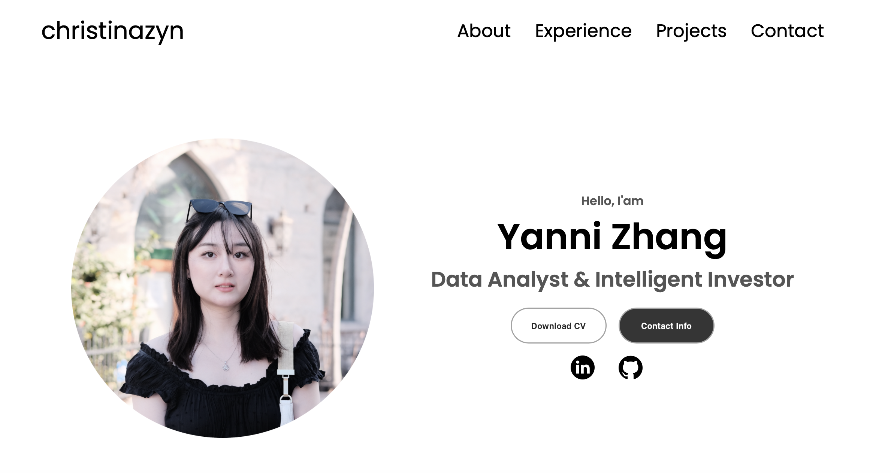

# My Portfolio Website

Welcome to my portfolio website, where I showcase my projects and skills as a data analyst and a developer. This site is a reflection of my journey and passion for coding.



[](LICENSE)
[](https://github.com/christinazyn/portfolio/stargazers)
[](https://github.com/christinazyn/portfolio/network/members)
[](https://github.com/christinazyn/portfolio/issues)
[](https://github.com/christinazyn/portfolio/pulls)

## Table of Contents

- [Demo](#demo)
- [Contributing](#contributing)
- [Acknowledgments](#acknowledgments)

## Demo

[Please Click Here](https://christinazyn.netlify.app/)

## Contributing

Suggestions are welcome!

## Acknowledgments

Great thanks to an amazing Youtuber [@howtobecomeadeveloper](https://www.youtube.com/@howtobecomeadeveloper) that teaches me from scratch.

```bash
# Clone the repository
git clone https://github.com/christinazyn/portfolio.git

# Change directory
cd portfolio
```
